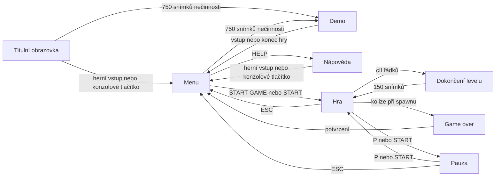

# Zadání: Tetris pro Atari XL/XE

Rekonstruováno podle `tetris.asm` dne 11. 9. 2026. Cílem je umožnit vytvoření
nové hry se stejnými pravidly, podobným tempem a stejným rozvržením obrazovek.
Dokument obsahuje i konkrétní herní data; pro jejich použití není nutné číst
původní assembler. Názvy původních rutin slouží pouze pro dohledání původu.

Zadání popisuje existující funkce. Nepředstavuje důkaz, že jiná implementace
už prošla ověřením. Kritéria v kapitole 12 se musí na nové hře teprve ověřit.
Při budoucím vývoji tohoto projektu je autoritou kód a zadání se aktualizuje
spolu s ním. Bitově shodný XEX ani stejná náhodná posloupnost nejsou požadované.

## 1. Výsledek a platforma

Vytvořit hratelný Tetris v assembleru 6502 pro Atari XL/XE, sestavitelný MADS
do souboru `tetris.xex`. Cílové časování je PAL 50 Hz. Hra má titulní obrazovku,
menu, nápovědu, tři obtížnosti, dvacet levelů, autonomní demo a zvuky POKEY.
Vizuální charakter tvoří systémové písmo, tenká studna, plné jednobarevné
kostky, zelená nápověda vlevo a teple zbarvený informační panel vpravo.

Použít Atari OS ROM pro font a obsluhu vektorů přerušení. Hra BASIC nevyužívá,
přímo ovládá grafiku, zvuk a vstupní hardware. Výstup má obsahovat adresu RUN
pro XEX loader. Podporu NTSC původní implementace samostatně neřeší.

Odevzdat zdroj hry, příkaz pro sestavení, popis ovládání a opakovatelné
ověřovací scénáře. U nové implementace musí scénáře kontrolovat výsledky
asercemi; obraz a zvuk ověřit také v plném emulátoru nebo na Atari.

## 2. Obrazovky a průchod aplikací



„Herní vstup“ zde znamená některou z namapovaných akcí v kapitole 3.
Nenamapované klávesy nejsou univerzálním potvrzením ani přerušením dema.
Při změně obrazovky počkat na uvolnění vstupů, aby potvrzovací stisk neprovedl
další akci na následující obrazovce. Po návratu ze hry se znovu neukazuje úvod.

### Titulní obrazovka

Zobrazit `TETRIS` v ANTIC mode 7 s animovanými duhovými pruhy, podtitul
`ATARI XL/XE EDITION` a blikající výzvu `PRESS START OR FIRE`.
Nápověda vysvětluje cíl řádků, struktury v ADVANCED, skrytý NEXT v EXPERT
a možnost počkat na demo. Úvod přijímá kterýkoli namapovaný herní vstup
nebo START/SELECT/OPTION, přestože výzva jmenuje jen START/FIRE.

### Menu

Čtyři položky v pořadí `START GAME`, `LEVEL`, `SKILL`, `HELP`.
Výchozí volba je START GAME, level 1, obtížnost EASY. Level a obtížnost
zůstávají zachované při návratu do menu; výběr položky se při návratu ze hry
vrací na START GAME. Po návratu z HELP zůstává vybrané HELP.

Nahoru/dolů posouvá výběr s přechodem mezi poslední a první položkou.
Vlevo/vpravo snižuje/zvyšuje LEVEL nebo cykluje SKILL na právě vybrané položce.
FIRE spustí START GAME, otevře HELP nebo zvýší zvolenou hodnotu.
START spustí hru z libovolné položky. SELECT vždy zvýší level, OPTION vždy
přepne obtížnost. Běžně lze vybrat 1–15, přechody přes hranice jsou cyklické.
Zvolená položka je světlá, ostatní zelené; u vybrané bliká šipka `>` po 8 snímcích.

### HELP

Samostatná textová obrazovka na černém pozadí bez PMG. Nadpis `TETRIS - HELP`,
sekce SKILL, LEVELS, CONTROLS. Popsat všechny tři obtížnosti, ROWS x/y,
rychlost levelu, podmínku game over a ovládání. Návrat novým namapovaným
herním vstupem nebo START/SELECT/OPTION. Na HELP neběží odpočet pro demo.

## 3. Vstupy

Joystick je v portu 1. Klávesy číst přes KBCODE s maskou `$3F`; stav stisku
určuje bit 2 SKSTAT. SELECT/OPTION/START jsou konzolová tlačítka Atari.

| Akce ve hře | Joystick | Klávesa | KBCODE po masce |
|---|---|---|---|
| Vlevo | vlevo | šipka vlevo | `$06` |
| Vpravo | vpravo | šipka vpravo | `$07` |
| Rotace, vstup nahoru | nahoru | šipka nahoru, X | `$0E`, `$16` |
| Rotace, vstup FIRE | FIRE | Z, RETURN | `$17`, `$0C` |
| Soft drop | dolů | šipka dolů | `$0F` |
| Hard drop | — | mezerník | `$21` |
| Pauza | — | P nebo konzolové START | `$0A` pro P |
| Návrat do menu | — | ESC | `$1C` |
| Další level, pouze DEV | — | N | `$23` |
| Game over, pouze DEV | — | G | `$3D` |

Rozlišovat držený vstup a novou hranu stisku. Rotace, hard drop, pauza
a akce menu reagují na novou hranu; boční pohyb má opakování při držení.
Současné vstupy z joysticku a klávesnice se slučují. Při souběhu vlevo/vpravo
má vlevo přednost. Rotace nahoru a FIRE provede nejvýše jednu rotaci za krok.

## 4. Studna, dílky a pohyb

Herní plocha má šířku 10 a výšku 24, všechny řádky jsou viditelné.
Souřadnice začínají vlevo nahoře na (0,0), X roste doprava, Y dolů.
Buňka je prázdná nebo obsahuje část usazeného dílku. Aktivní dílek je oddělený
od usazené plochy až do zamknutí. Sedm typů v pořadí I, O, T, S, Z, J, L
má po čtyřech rotačních variantách; přesné lokální souřadnice jsou v příloze A.

Na začátku hry připravit NEXT. Při spawnu převzít NEXT do aktivního kusu,
vylosovat nový NEXT, nastavit rotaci 0 a počátek X=3/Y=0. Pokud některá buňka
leží mimo studnu nebo v obsazené buňce, zahájit game over. Při kolizích
posuzovat buňky dílku, ne celý jeho obdélník; počátek proto může být záporný,
pokud všechny skutečné buňky stále leží ve studni.

Losování: získat náhodnou hodnotu 0–7, hodnotu 7 odmítat. Pokud přijatý typ
odpovídá předchozímu NEXT, provést právě jedno další losování 0–6 a přijmout
jeho výsledek i při opakování. Opakované kusy tedy možné jsou; zásobník typu
„7-bag“ se nepoužívá. Náhodnost nemusí být mezi implementacemi shodná.

- **Boční pohyb:** při novém stisku okamžitě o jednu buňku, potom po 12
  dalších krocích držení a dále každé 4 kroky. Po uvolnění čítač vynulovat.
  Neplatný pohyb polohu nezmění.
- **Rotace:** přejít na `(rotace+1) mod 4`. Vyzkoušet vodorovné posuny
  v pořadí `0,-1,+1,-2,+2`; přijmout první platný. Y se nemění. Když se žádný
  nevejde, zachovat polohu i rotaci a přehrát odmítnutí. Všechny rotační
  vstupy postupují stejným směrem.
- **Gravitace:** po intervalu daném levelem zkusit posun dolů o jednu buňku.
  Není-li možný, okamžitě zamknout; další čekací doba na zamknutí není.
- **Soft drop:** po 2 krocích držení zkusit posun dolů, při úspěchu přičíst
  bod a znovu nastavit celý gravitační interval. Po spawnu musí hra nejprve
  zaznamenat uvolněný směr dolů; držení z předchozího kusu nový kus nezrychlí.
  Při neúspěšném soft dropu kus zamknout. Gravitace mezitím normálně běží.
- **Hard drop:** v jediném kroku sesunout kus do nejnižší dosažitelné polohy,
  přičíst 2 body za každou uraženou buňku a ihned zamknout.

Pořadí akcí v kroku padajícího dílku je boční pohyb, rotace, hard drop,
soft drop, gravitace; hard drop krok ukončuje, úspěšný soft drop přeskočí
gravitaci. Skórování pohybu dolů platí i v demu.

## 5. Mazání řad a skóre

Po zamknutí vyhledat plné řady. Bez nich pokračovat spawnem. Jedním kusem
se běžně smaže 1–4 řad. Při nálezu přehrát zvuk LINE nebo TETRIS pro čtyři řady,
na 24 snímků zastavit pád dalšího kusu a přepínat viditelnost řad po 4 snímcích
(tři cykly). Pak je odstranit a vyšší řádky posunout dolů; nahoře doplnit prázdno.
Případné další plné řady znovu zpracovat před novým spawnem.

| Počet řad současně | Body násobené současným levelem |
|---|---:|
| 1 | 40 |
| 2 | 100 |
| 3 | 300 |
| 4 | 1200 |

Přičíst počet řad do celkového LINES i do ROWS aktuálního levelu. Skóre za
drop nemá násobič levelu. Po dokončení levelu přičíst samostatně 1000 × jeho
číslo. Skóre se zobrazuje na 6 číslic, LINES na 4, s počátečními nulami;
původní BCD čítače se po vyčerpání této šířky přetáčejí. Combo, back-to-back,
T-spin bonus, hold, ghost piece ani ukládání rekordů nejsou součástí hry.

## 6. Obtížnosti a levely

| Obtížnost | Začátek každého levelu | NEXT |
|---|---|---|
| EASY | prázdná studna | viditelný |
| ADVANCED | struktura z přílohy B | viditelný |
| EXPERT | stejná struktura jako ADVANCED | skrytý včetně rámečku a nápisu |

Číslo levelu určuje rychlost a počet požadovaných řad; obtížnost tyto hodnoty
nemění. Kompletní tabulka je v příloze C. Nová hra začíná vybraným levelem,
s nulovým skóre, LINES, časem a ROWS. NEXT i aktivní kus používají normální
rotaci 0 ve všech obtížnostech.

Level je splněn, když ROWS dosáhne nebo překročí jeho cíl. Počítá se počet
řad, nikoli vyprázdnění studny. Přehrát dvouhlasou fanfáru, přičíst bonus
a na 150 snímků zobrazit `LEVEL COMPLETE - GET READY`. Potom vyčistit celou
studnu, zvýšit level nejvýše na 20, nastavit jeho rychlost, ROWS=0 a nový cíl
a v ADVANCED/EXPERT vložit strukturu. Přebytečné řady nad cílem se do nového
ROWS nepřenášejí. Celkové skóre, LINES, čas a připravený NEXT pokračují.
Po splnění levelu 20 se znovu připravuje level 20; vítězná obrazovka není.

Vzory 1–12 se vkládají dolů do studny, jejich řádky jsou zapsané shora dolů.
Pro level nad 12 opakovaně odečítat 6, dokud číslo vzoru není nejvýše 12:
13→7, 14→8, …, 18→12, 19→7, 20→8. V levelech 13–20 je pod vzorem jedna
výplňová řada `#.##.###.#`. Výše ležící nevyplněná část studny je prázdná.

## 7. Pauza, čas, game over a DEV

P nebo START v běžné hře přepíná pauzu. Zobrazit `PAUSED - PRESS P TO CONTINUE`.
Při pauze stojí herní stavy, gravitace, boční opakování, blikání mazaných řad
i čas; VBI, grafika a zvukový sekvencer pokračují. ESC funguje i v pauze.
Čas je mm:ss, po 50 aktivních krocích přibude sekunda, po 60 sekundách minuta;
po 99:59 se přetočí. Počítá i demo, mazání řad a dokončení levelu.

Původní dokončení levelu a game over jsou samostatné blokující sekvence:
ESC je přeruší, ale jejich animační odpočty po stisku pauzy dále pokračují.
Tato zvláštnost patří k referenčnímu chování; nejde o globální zmrazení VBI.

Game over nastane až při neplatném spawnu. Přehrát sestupný zvuk a postupně
zaplnit všech 24 řádků odspodu, jeden řádek za 2 snímky. Čas už nepřičítat.
Po animaci zobrazovat `GAME OVER - PRESS FIRE OR START` a čekat na nový FIRE,
nahoru, hard drop nebo START; klávesové ekvivalenty platí. ESC vrací do menu
i během animace. V demu je zpráva jen `GAME OVER` a po zaplnění se automaticky
čeká 150 snímků před návratem do menu.

OPTION držený při startu XEX trvale aktivuje DEV pro tento běh programu.
V menu zpřístupní levely 1–20 a ve hře ukáže `DEV`. Klávesa N zvýší level
nejvýše na 20 a ihned znovu připraví studnu/cíl/rychlost bez bonusu a fanfáry.
G vyvolá game over přes zablokovaný spawn. Bez DEV jsou obě klávesy neúčinné;
v demu se vývojářské zkratky neprovádějí.

## 8. Vzhled herní obrazovky

Graphics 0 / ANTIC mode 2, systémový ROM font, 40 sloupců × 26 řádků
po 8×8 pixelech. Před textem osm prázdných scanlinů. Pozice v tabulce jsou
nulované, vztahují se k textu a nezahrnují horní prázdný pás.

| Prvek | Sloupec/sloupce | Řádek/řádky |
|---|---|---|
| Levá a pravá stěna | 14 a 25 | 0–23 |
| Buňky studny | 15–24 | 0–23 |
| Dno s rohy | 14–25 | 24 |
| NEXT nápis | 32 | 0 |
| NEXT rámeček | 31–36 | 1–6 |
| NEXT vnitřek | 32–35 | 2–5 |
| LEVEL popisek/hodnota | 30 | 9/10 |
| SCORE popisek/hodnota | 30 | 12/13 |
| LINES popisek/hodnota | 30 | 15/16 |
| ROWS popisek/hodnota | 30 | 18/19 |
| TIME popisek/hodnota | 30 | 21/22 |
| MOVE / STICK | 2 / 3 | 2 / 3 |
| ROTATE / FIRE | 2 / 3 | 5 / 6 |
| DROP / DOWN | 2 / 3 | 8 / 9 |
| HARD / SPACE | 2 / 3 | 11 / 12 |
| PAUSE / P | 2 / 3 | 14 / 15 |
| MENU / ESC | 2 / 3 | 17 / 18 |
| EASY, ADVANCED nebo EXPERT | 2 | 22 |
| DEMO (jen při demu) | 2 | 0 |
| DEV (jen v DEV) | 2 | 24 |
| Zpráva demo / pauza / level / game over | 1 / 6 / 7 / 4 | 25 |
| Game over v demu | 15 | 25 |

Kostka je plný znak 8×8, všechny typy mají stejný vzhled. Prázdná buňka je
mezera. Rámečky jsou tenké čáry systémového fontu; interní kódy:
plný blok `$80`, rohy levý horní `$51`, pravý horní `$45`, levý dolní `$5A`,
pravý dolní `$43`, vodorovná `$52`, svislá `$7C`.

NEXT vycentrovat podle skutečného ohraničujícího obdélníku rotace 0.
V každé ose platí odsazení `floor((4-velikost)/2)` od vnitřního okraje.
Nevykreslovat větší buňky než ve studni. ROWS ukazuje dvě číslice, lomítko
a dvě číslice cíle, LEVEL dvě číslice, TIME mm:ss.

Černé pozadí má kód `$00`, jas textu je `$0C`. PMG pruh vlevo používá `$B0`,
panel `$20`, studna `$02`. V hi-res textu má svítící pixel odstín hráče
a jas textu, ostatní pixely barvu hráče. Proto je nápověda jasně zelená na
tmavě zeleném pásu, panel světlý teplý na tmavě červeném pásu, studna šedá.
NEXT leží mimo pruhy. Barva studny je v celé výšce stejná; hra nemá řádkový DLI.

Pruhy PMG: P0 čtyřnásobná šířka, sloupce 1–8/řádky 1–23; P1 čtyřnásobná,
sloupce 29–36/řádky 8–23; P2 čtyřnásobná, sloupce 14–21/řádky 0–24;
P3 dvojnásobná, sloupce 22–25/řádky 0–24. Použít single-line DMA a prioritu
hráčů nad playfieldem. Horní PMG souřadnice řádku r je `16+8*r`.

V demu bliká inverzí `DEMO` a dolní text
`DEMO PLAY - MOVE STICK OR PRESS A KEY`. Inverzi přepínat po 16 snímcích;
stejně bliká zpráva dokončení levelu. Doslovná výzva dema jmenuje libovolnou
klávesu, ale skutečné přerušení se řídí mapováním z kapitoly 3.

## 9. Titulek a menu – grafické provedení

Použít samostatný display list. Horní pás má 24 prázdných scanlinů,
titulek mode 7 je 16 scanlinů vysoký, 20 znaků široký; `TETRIS` začíná na
sloupci 7. Po osmi prázdných scanlinech následuje mode 6 podtitulek od sloupce 0.
Po 16 prázdných scanlinech jsou čtyři mode 6 položky menu oddělené osmi
prázdnými scanliny. Text položek začíná na sloupci 3, hodnoty na sloupci 12,
šipka na sloupci 1. Potom čtyři řádky mode 2 nápovědy a závěrečný text.

Pozadí/border menu `$92`, běžné položky `$CA`, vybraná položka `$0E`,
podtitul `$28`. Menu nemá PMG. Duha titulku používá 32 barev:
`1A,1C,2A,2C,3A,3C,4A,4C,5A,5C,6A,6C,7A,7C,8A,8C,`
`9A,9C,AA,AC,BA,BC,CA,CC,DA,DC,EA,EC,FA,FC,0A,0E` (hex).
V 16 po sobě jdoucích scanlinech nastavit další barvu, začátek palety
posouvat po 2 snímcích s cyklem 32 barev. Po titulku obnovit běžnou barvu.

## 10. Automatické demo

Na titulní obrazovce a v menu počítat nečinnost. Každý držený namapovaný
vstup či konzolové tlačítko odpočet nuluje. Po 750 snímcích spustit novou
hru se zvoleným levelem/obtížností řízenou AI, s nulovým skóre a časem.
Před krokem AI zkontrolovat skutečný uživatelský vstup; při jeho výskytu
demo okamžitě opustit. Demo hraje podle stejných pravidel jako člověk.

Při spawnu AI vyhodnotí kandidáty: počty rotací pro I,O,T,S,Z,J,L jsou
`2,1,4,2,2,4,4`, X se zkouší od -2 do 9. Pokud se kus vejde na Y=0,
spustit jej svisle do nejnižší platné polohy a zkusmo přidat do plochy.
Změřit pro každý sloupec výšku od první obsazené buňky ke dnu a počet
obsazených buněk. Z těchto hodnot odvodit:

- `Agg`: součet výšek sloupců;
- `Holes`: součet (výška − počet obsazených buněk), tedy díry pod kostkami;
- `Bump`: součet absolutních rozdílů výšek sousedních sloupců;
- `MaxH`: nejvyšší sloupec;
- `FullL`: počet plných řádků v hypotetické ploše.

Před oceněním snížit Agg o `10*FullL` a MaxH o `FullL`.
Minimalizovat `1000 + 3*Agg + 12*Holes + 2*Bump + 6*MaxH - 24*FullL`,
ke každému kandidátovi přidat náhodný šum 0–31. Při shodě ponechat první
kandidát. Hypotetické vložení nesmí změnit skutečnou herní plochu.

Po spawnu AI čeká s čítačem 14; v kroku s nenulovým čítačem jej sníží
a nic neprovede. Při nule udělá jeden tah a nastaví čítač na náhodných 6–9.
Nejdříve rotuje k cíli, potom se posouvá vodorovně. Po dosažení cíle náhodně
zvolí hard drop nebo trvalé držení dolů. Gravitace běží i během přemýšlení.
AI neplánuje složité cesty pod převisy a nemá zaručenou cestu k vybranému cíli.
Má působit jako nedokonalý hráč; přesná délka přežití závisí na náhodě.

## 11. Zvuk a technické požadavky

Použít čtyři osmibitové kanály POKEY, `AUDCTL=0`, `SKCTL=3`.
Efekty popisují trojice `(AUDF,AUDC,délka)` v příloze D. Nový efekt nahradí
předchozí na stejném kanálu; efekty na jiných kanálech pokračují.
Fanfára má dvě sekvence spuštěné současně na kanálech 2 a 3 (číslováno od 0).

Sekvencer jednou za VBI: u aktivního kanálu s nenulovým čítačem pouze
snížit čítač; při nule načíst další trojici, zapsat AUDF/AUDC a nastavit
čítač na délku. Délka 0 ukončí efekt a ztiší kanál. Tón proto trvá do dalšího
zápisu `délka+1` tiků VBI; délky nejsou přímo počty milisekund. Při návratu
ze hry umlčet všechny kanály.

Přehrát MOVE při úspěšném bočním pohybu, ROT při úspěšné rotaci, NOROT při
odmítnuté rotaci, SOFT při úspěšném soft dropu. DROP zazní při zamknutí bez
plných řad. LINE/TETRIS při jejich nálezu, FANF1/FANF2 při dokončení levelu,
OVER při game over, MENU při posunu menu/změně hodnot, SELECT při potvrzení
a PAUSE při přepnutí pauzy.

Pro obdobnou nativní implementaci rezervovat ZP pro ukazatele a dočasné
hodnoty, RAM pro 10×24 usazených buněk, složený obraz a poslední obraz.
Referenční rozložení: ZP `$80–$91`, kód/data od `$2000` pod `$5000`,
PMG `$5000–$57FF`, herní obrazovka `$6000–$640F` s mazáním až do `$64FF`,
menu `$6A00–$6BFF`, display listy `$7000`/`$7100`, ROM font `$E000–$E3FF`.
Jiné adresy jsou přípustné při zachování funkce a nepřekrývání oblastí.

Instalovat VBI přes VVBLKI a vracet se přes XITVBV, DLI přes VDSLST s vlastní
obnovou registrů a RTI. BCD aritmetika nesmí poškodit přerušení: před jejich
výpočty vyčistit decimal flag. Synchronizovat herní krok s VBI. VBI nastavuje
display list a barvy každého snímku, aby se zachoval správný obraz při použití OS.
Při změně obrazovky měnit současně display list i režim DLI. Každá nová hra
musí obnovit svůj herní stav bez spoléhání na obsah RAM před spuštěním.

## 12. Přejímací scénáře

Toto jsou požadavky na ověření nové implementace. Současný `tools/test_game.py`
je pouze část podkladu: přehrává některé scénáře a ukládá obraz, nemá jejich
automatické aserce. Úspěch tohoto skriptu sám nesplňuje celý následující seznam.

| ID | Příprava a akce | Očekávaný výsledek |
|---|---|---|
| A01 | Spustit XEX, potvrdit úvod | Menu se čtyřmi položkami, level 01/EASY, bez okamžitého spuštění hry týmž stiskem |
| A02 | Projít menu, měnit obě hodnoty přes hranice | Cyklický výběr 1–15 a EASY/ADVANCED/EXPERT, START vždy spustí hru |
| A03 | Otevřít HELP, vrátit se | Čitelná nápověda bez PMG, obnovené menu s vybraným HELP |
| A04 | Spustit EASY | Prázdných 10×24 usazených buněk, aktivní dílek, NEXT, ROWS 00/05, nulové LINES |
| A05 | Vyzkoušet dílky u stěn, podlahy a překážek | Žádná buňka mimo studnu/přes jinou, kicky v předepsaném pořadí, platný spawn |
| A06 | Držet boční směr a dolů, poté vytvořit další kus | Správné DAS, soft drop po uvolnění dolů u nového kusu, žádný přenos rychlého pádu |
| A07 | Hard drop do prázdné studny | Nejnižší platná poloha, okamžité zamknutí, skóre +2 × vzdálenost |
| A08 | Připravit samostatně 1, 2, 3 a 4 plné řady | 24 snímků blikání, správné sesednutí, body 40/100/300/1200 × level, správné oba čítače řad |
| A09 | Level 1, ROWS=4, doplnit jednu řadu | Bonus 1000 navíc ke skóre řady, po sekvenci level 2, ROWS 00/07, rychlost 36 |
| A10 | Dokončit level 20 | Znovu level 20, ROWS 00/20, rychlost 2; skóre a čas pokračují |
| A11 | Stejný level v ADVANCED a EXPERT | Identická startovní struktura; EXPERT nemá ani rám/nápis NEXT |
| A12 | Ověřit všechny struktury a levely 13–20 | Shoda s přílohou B, vzory nad 12 v cyklu 7–12 a výplňový řádek dole |
| A13 | P/START při pádu, počkat, obnovit; ESC v pauze | Kus/čas během pauzy stojí, pokračování ze stejného stavu, ESC vrací do menu |
| A14 | Zablokovat spawn | Game over, postupné plnění odspodu, zastavený čas, správný návrat po potvrzení |
| A15 | Nechat úvod/menu bez vstupu 750 snímků | Demo se správným označením, AI provádí normální pohyby; mapovaný vstup je ukončí |
| A16 | Nenamapovaná klávesa v demu, následně mezerník | První klávesa demo neukončí, mezerník ano |
| A17 | Spuštění s OPTION a bez něj, potom N/G | DEV povolí 1–20 a zkratky, běžná hra na N/G nereaguje |
| A18 | Opakovaně hra → ESC/game over → menu → hra | Správná grafika, nová hra bez zbytků plochy/skóre/časovačů, bez přenosu stisku |
| A19 | Zachytit jednotlivé obrazovky | Pozice, barvy, měřítko NEXT, chybějící NEXT v EXPERT a všech 26 řádků odpovídají zadání |
| A20 | Vyvolat všechny zvuky, souběžně fanfáru | Správné kanály/trojice, překrývání podle kanálů, slyšitelný výsledek v plném emulátoru nebo na Atari |

U krokových testů oddělit počet VBI od vykreslení screenshotu; referenční
harness při `screenshot()` provede další snímek. Náhodný generátor pro
ověřování řídit seedem nebo dodanou posloupností. Shodu rozvržení kontrolovat
na samostatných snímcích; složený přehled může obrazovky různých výšek oříznout.

## 13. Mapa původu požadavků

| Oblast zadání | Podklad v referenčním `tetris.asm` |
|---|---|
| Úvod, menu, HELP | TitleScreen, MenuScreen, DrawMenuItems, HelpScreen, HelpTab |
| Vstupy | ReadInputs, KeyMapCode/KeyMapBit, WaitRelease |
| Dílky a pohyb | PieceTab, RandomPiece, StSpawn, StFall, Fits, TryRotate, HardDrop |
| Řady a skóre | LockPiece, FindFull, StClear, RemoveFullRows, ScoreLines, AddScore |
| Levely a struktury | StartLevel, FillPattern, LevelDoneSeq, SpeedTab, TargetTab, Pat1–Pat12 |
| Pauza, čas a DEV | start, FrameStep, GameOverSeq |
| Obraz | SetGameScreen, DrawNext, DrawValues, InitPMG, Vbi, Dli, GameDL, MenuDL |
| Demo | IdleTick, AiPlan, Evaluate, AiStep |
| Zvuk | PlaySfx, SoundTick, SfxChan, Sd* |

Přílohy níže jsou datový snímek těchto tabulek. Jsou součástí zadání;
při změně zdrojových tabulek se musí aktualizovat spolu s textem.

## Příloha A: tvary dílků

Každá položka je čtveřice `(dx,dy)` vůči počátku dílku. Rotace se cyklují
0→1→2→3→0. I, S a Z mají geometricky podobné varianty s jiným posunem v
lokální mřížce; tyto posuny zachovat. O se při rotaci vizuálně nemění.

| Typ | Rotace 0 | Rotace 1 | Rotace 2 | Rotace 3 |
|---|---|---|---|---|
| I | `(0,1) (1,1) (2,1) (3,1)` | `(2,0) (2,1) (2,2) (2,3)` | `(0,2) (1,2) (2,2) (3,2)` | `(1,0) (1,1) (1,2) (1,3)` |
| O | `(1,0) (2,0) (1,1) (2,1)` | `(1,0) (2,0) (1,1) (2,1)` | `(1,0) (2,0) (1,1) (2,1)` | `(1,0) (2,0) (1,1) (2,1)` |
| T | `(0,1) (1,1) (2,1) (1,0)` | `(1,0) (1,1) (1,2) (2,1)` | `(0,1) (1,1) (2,1) (1,2)` | `(1,0) (1,1) (1,2) (0,1)` |
| S | `(1,0) (2,0) (0,1) (1,1)` | `(1,0) (1,1) (2,1) (2,2)` | `(1,1) (2,1) (0,2) (1,2)` | `(0,0) (0,1) (1,1) (1,2)` |
| Z | `(0,0) (1,0) (1,1) (2,1)` | `(2,0) (1,1) (2,1) (1,2)` | `(0,1) (1,1) (1,2) (2,2)` | `(1,0) (0,1) (1,1) (0,2)` |
| J | `(0,0) (0,1) (1,1) (2,1)` | `(1,0) (2,0) (1,1) (1,2)` | `(0,1) (1,1) (2,1) (2,2)` | `(1,0) (1,1) (0,2) (1,2)` |
| L | `(2,0) (0,1) (1,1) (2,1)` | `(1,0) (1,1) (1,2) (2,2)` | `(0,1) (1,1) (2,1) (0,2)` | `(0,0) (1,0) (1,1) (1,2)` |

## Příloha B: startovní struktury

`#` je obsazená buňka, `.` prázdná. Každý blok je zapsaný shora dolů;
jeho poslední řádek patří na dno, případně nad výplňový řádek levelů 13–20.
Nad blokem jsou všechny buňky prázdné. Data platí pro ADVANCED a EXPERT.

### Vzor 1 (1 řádků)

```text
.#......#.
```

### Vzor 2 (4 řádků)

```text
#........#
#........#
##......##
###....###
```

### Vzor 3 (6 řádků)

```text
....##....
..........
#........#
##......##
###....###
####..####
```

### Vzor 4 (6 řádků)

```text
..#....#..
.##....##.
###....###
#.#....#.#
#........#
###.##.###
```

### Vzor 5 (7 řádků)

```text
##......##
#........#
#..####..#
#..#..#..#
#..####..#
#........#
####..####
```

### Vzor 6 (8 řádků)

```text
.#......#.
.#......#.
.#..##..#.
.#..##..#.
.#......#.
##......##
##.####.##
##.#..#.##
```

### Vzor 7 (8 řádků)

```text
###....###
..#....#..
..........
.###..###.
.#......#.
.#......#.
##..##..##
#...##...#
```

### Vzor 8 (9 řádků)

```text
#........#
#.##..##.#
#.#....#.#
#........#
#.######.#
#........#
##.#..#.##
#..#..#..#
#.##..##.#
```

### Vzor 9 (10 řádků)

```text
....##....
....##....
.#......#.
.##....##.
.##.##.##.
.##....##.
.#......#.
##......##
#.#.##.#.#
#.#....#.#
```

### Vzor 10 (11 řádků)

```text
#.#....#.#
###....###
..........
.########.
.#......#.
.#.####.#.
.#......#.
.########.
..........
##.#..#.##
#..#..#..#
```

### Vzor 11 (12 řádků)

```text
#........#
##......##
#.#....#.#
#..#..#..#
#...##...#
#..#..#..#
#.#....#.#
##......##
#........#
#.######.#
#........#
###.##.###
```

### Vzor 12 (14 řádků)

```text
.#.#..#.#.
.#.#..#.#.
.#.#..#.#.
.###..###.
..........
########..
..........
..########
..........
##.####.##
#..#..#..#
#.##..##.#
#........#
###.##.###
```

Výplňový řádek pro levely 13–20:

```text
#.##.###.#
```

Referenční kód obsahuje ještě `FillerB = ##.#.#.##.` pro střídání při více
výplňových řadách. Při maximu levelu 20 se druhá výplňová řada nepoužije.

## Příloha C: rychlosti a cíle

| Level | Snímky na řádek | Sekundy na řádek při 50 Hz | Cíl řádků | Vzor pro ADVANCED/EXPERT | Výplňových řad |
|---|---:|---:|---:|---:|---:|
| 1 | 40 | 0,80 | 5 | 1 | 0 |
| 2 | 36 | 0,72 | 7 | 2 | 0 |
| 3 | 32 | 0,64 | 9 | 3 | 0 |
| 4 | 28 | 0,56 | 11 | 4 | 0 |
| 5 | 24 | 0,48 | 12 | 5 | 0 |
| 6 | 20 | 0,40 | 13 | 6 | 0 |
| 7 | 17 | 0,34 | 14 | 7 | 0 |
| 8 | 14 | 0,28 | 15 | 8 | 0 |
| 9 | 12 | 0,24 | 16 | 9 | 0 |
| 10 | 10 | 0,20 | 17 | 10 | 0 |
| 11 | 8 | 0,16 | 18 | 11 | 0 |
| 12 | 7 | 0,14 | 18 | 12 | 0 |
| 13 | 6 | 0,12 | 19 | 7 | 1 |
| 14 | 5 | 0,10 | 19 | 8 | 1 |
| 15 | 4 | 0,08 | 20 | 9 | 1 |
| 16 | 4 | 0,08 | 20 | 10 | 1 |
| 17 | 3 | 0,06 | 20 | 11 | 1 |
| 18 | 3 | 0,06 | 20 | 12 | 1 |
| 19 | 2 | 0,04 | 20 | 7 | 1 |
| 20 | 2 | 0,04 | 20 | 8 | 1 |

## Příloha D: zvukové sekvence

Kanály jsou číslované 0–3 (POKEY AUDF1/AUDC1 až AUDF4/AUDC4).
Trojice jsou `AUDF/AUDC/délka`, registry v hexadecimálním zápisu a délka
desítkově. Každou sekvenci ukončuje `0/0/0`, v tabulce vynechané.
Přesné časování čítače popisuje kapitola 11.

| Efekt | Kanál | Trojice v pořadí |
|---|---:|---|
| MOVE | 0 | `$40/$A4/2` |
| ROT | 0 | `$30/$A6/2, $20/$A6/2` |
| DROP | 1 | `$60/$88/2, $FF/$86/3, $FF/$83/3` |
| SOFT | 1 | `$70/$A2/1` |
| LINE | 2 | `$60/$A8/3, $50/$A8/3, $40/$A8/3, $30/$A8/3, $20/$AA/5` |
| TETRIS | 2 | `$60/$AA/3, $48/$AA/3, $40/$AA/3, $30/$AA/3, $24/$AA/3, $1E/$AC/4, $18/$AC/8` |
| FANF1 | 2 | `$3C/$A8/8, $2F/$A8/8, $28/$A8/8, $1D/$AA/6, $28/$A6/4, $1D/$AC/24, $1D/$A6/10, $1D/$A3/10` |
| FANF2 | 3 | `$79/$A6/8, $5F/$A6/8, $50/$A6/8, $3C/$A8/6, $50/$A4/4, $3C/$A8/24, $3C/$A4/10, $3C/$A2/10` |
| OVER | 2 | `$28/$A8/10, $2F/$A8/10, $3C/$A8/10, $50/$A8/10, $79/$AA/25, $FF/$88/10, $FF/$85/10, $FF/$82/10` |
| MENU | 0 | `$28/$A4/1, $20/$A4/1` |
| SELECT | 0 | `$20/$A6/3, $10/$A8/5` |
| PAUSE | 1 | `$40/$A6/3, $60/$A6/3` |
| NOROT | 0 | `$80/$C4/3` |

## Příloha E: text a pozice HELP

Poloha je řádek/sloupec textové mřížky 26×40, od nuly. Zachovat odsazení
pokračovacích řádků. Doslovná závěrečná výzva uvádí ANY KEY; vstupy se
přesto vyhodnocují podle kapitoly 3, stejně jako u referenční hry.

| Řádek | Sloupec | Text |
|---:|---:|---|
| 1 | 13 | `TETRIS - HELP` |
| 3 | 1 | `SKILL` |
| 4 | 1 | `EASY     EMPTY WELL, NEXT PIECE SHOWN` |
| 5 | 1 | `ADVANCED OBSTACLES IN THE WELL AT THE` |
| 6 | 1 | `         START OF EVERY LEVEL` |
| 7 | 1 | `EXPERT   OBSTACLES AND NO NEXT PIECE` |
| 9 | 1 | `LEVELS` |
| 10 | 1 | `EACH LEVEL HAS A ROW TARGET (ROWS X/Y)` |
| 11 | 1 | `AND A FALLING SPEED. CLEAR THE TARGET` |
| 12 | 1 | `TO ADVANCE. THE GAME ENDS WHEN A NEW` |
| 13 | 1 | `PIECE CANNOT ENTER THE WELL.` |
| 15 | 1 | `CONTROLS` |
| 16 | 1 | `STICK OR ARROWS    MOVE LEFT / RIGHT` |
| 17 | 1 | `FIRE, UP, Z, X     ROTATE` |
| 18 | 1 | `DOWN               SOFT DROP` |
| 19 | 1 | `SPACE              HARD DROP` |
| 20 | 1 | `P OR START         PAUSE` |
| 21 | 1 | `ESC                ABANDON GAME` |
| 22 | 1 | `SELECT / OPTION    LEVEL / SKILL (MENU)` |
| 24 | 4 | `PRESS ANY KEY OR FIRE TO RETURN` |

## Příloha F: texty úvodu a menu

Čtyři spodní textové řádky úvodu obsahují postupně následující texty
(počáteční sloupce 5, 1, 2 a 5 v mode 2):

- `CLASSIC TETRIS FOR ATARI XL/XE`
- `CLEAR THE ROW TARGET TO FINISH A LEVEL`
- `ADVANCED: OBSTACLES  EXPERT: NO NEXT`
- `WAIT A WHILE TO WATCH THE DEMO`

Menu zobrazuje první tři spodní řádky od sloupce 1; čtvrtý je prázdný:

- `STICK/ARROWS MOVE     FIRE/UP/Z ROTATE`
- `DOWN SOFT DROP        SPACE HARD DROP`
- `SELECT LEVEL   OPTION SKILL   ESC MENU`

Závěrečný řádek úvodu i menu po osmi prázdných scanlinech je od sloupce 5:

`(C) 2026 BYPS - MADS ASSEMBLER`.
